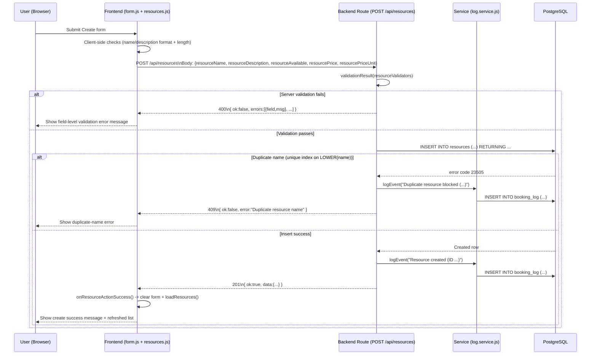
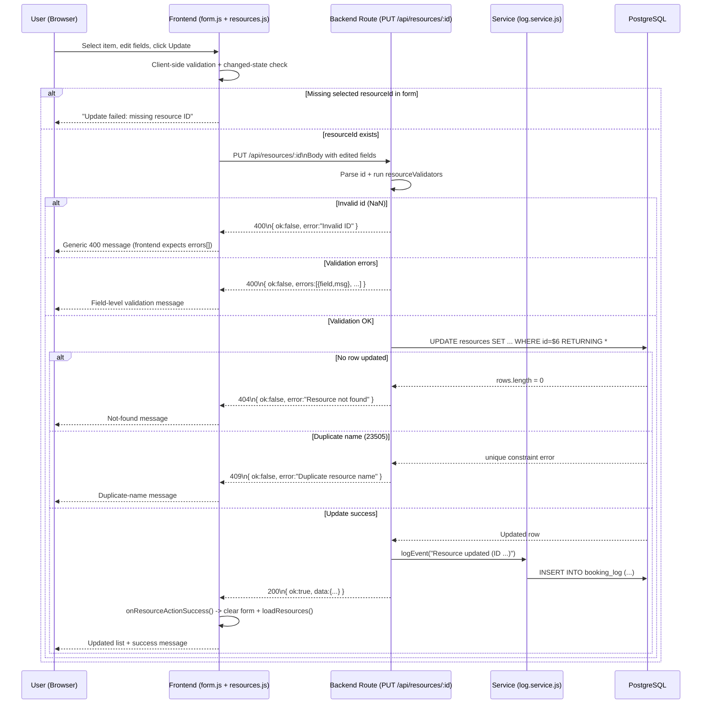
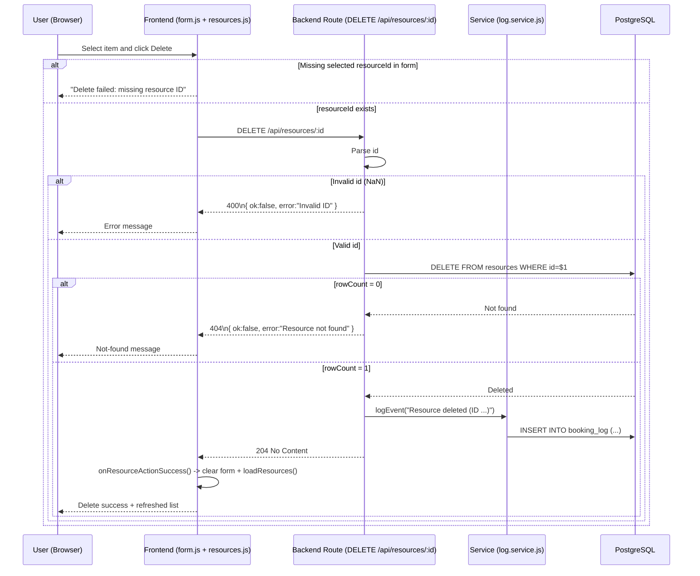

# G1 - CRUD Data Flow (Phase6 Booking System)

This file models the implemented Phase6 flow (frontend -> API route -> DB -> response).

Implementation references:
- Frontend: public/resources.js, public/form.js
- Routes: src/routes/resources.routes.js
- Validation: src/validators/resource.validators.js
- Service: src/services/log.service.js
- DB schema: db/init/001_create_resources.sql, db/init/002_create_logs.sql

## CREATE (C) - POST /api/resources



## READ (R) - GET /api/resources

```mermaid
sequenceDiagram
    participant U as User (Browser)
    participant F as Frontend (resources.js)
    participant B as Backend Route (GET /api/resources)
    participant S as Service (log.service.js)
    participant DB as PostgreSQL

    U->>F: Open /resources (or refresh after C/U/D)
    F->>B: GET /api/resources
    B->>DB: SELECT * FROM resources ORDER BY created_at DESC

    alt Query success
        DB-->>B: rows[]
        B-->>F: 200\n{ ok:true, data:[...] }
        F->>F: resourcesCache = body.data; renderResourceList(...)
        F-->>U: Updated resource list is displayed
    else Query fails
        DB-->>B: SQL error
        B-->>F: 500\n{ ok:false, error:"Database error" }
        F->>F: console.error(...); renderResourceList([])
        F-->>U: Empty/fallback list state
    end

    Note over S: No logEvent() call in READ ALL route.
```

## UPDATE (U) - PUT /api/resources/:id



## DELETE (D) - DELETE /api/resources/:id



## Endpoint/Status Summary

| CRUD | Method | Endpoint | Success | Failure paths implemented |
|---|---|---|---|---|
| Create | POST | /api/resources | 201 | 400, 409, 500 |
| Read (used by UI) | GET | /api/resources | 200 | 500 |
| Read one (route exists) | GET | /api/resources/:id | 200 | 400, 404, 500 |
| Update | PUT | /api/resources/:id | 200 | 400, 404, 409, 500 |
| Delete | DELETE | /api/resources/:id | 204 | 400, 404, 500 |

## Runtime Verification (2026-03-22)

Environment:
- docker compose up -d --build: success
- booking-system-phase6-web listening on port 5000
- booking-system-phase6-db initialized and running on 5432

Observed requests (real run):

| Scenario | Request | Status | Response shape |
|---|---|---|---|
| Read success | GET /api/resources | 200 | { ok:true, data:[...] } |
| Create validation fail | POST /api/resources | 400 | { ok:false, errors:[...] } |
| Create success | POST /api/resources | 201 | { ok:true, data:{ id, ... } } |
| Create duplicate fail | POST /api/resources (same name) | 409 | { ok:false, error:"Duplicate resource name" } |
| Update success | PUT /api/resources/3 | 200 | { ok:true, data:{...} } |
| Update not found fail | PUT /api/resources/999999 | 404 | { ok:false, error:"Resource not found" } |
| Delete success | DELETE /api/resources/3 | 204 | no body |
| Delete not found fail | DELETE /api/resources/3 again | 404 | { ok:false, error:"Resource not found" } |
