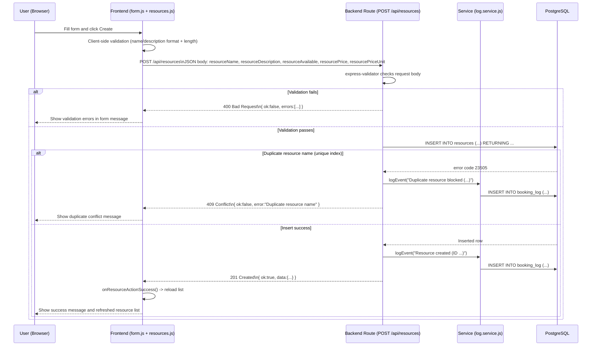
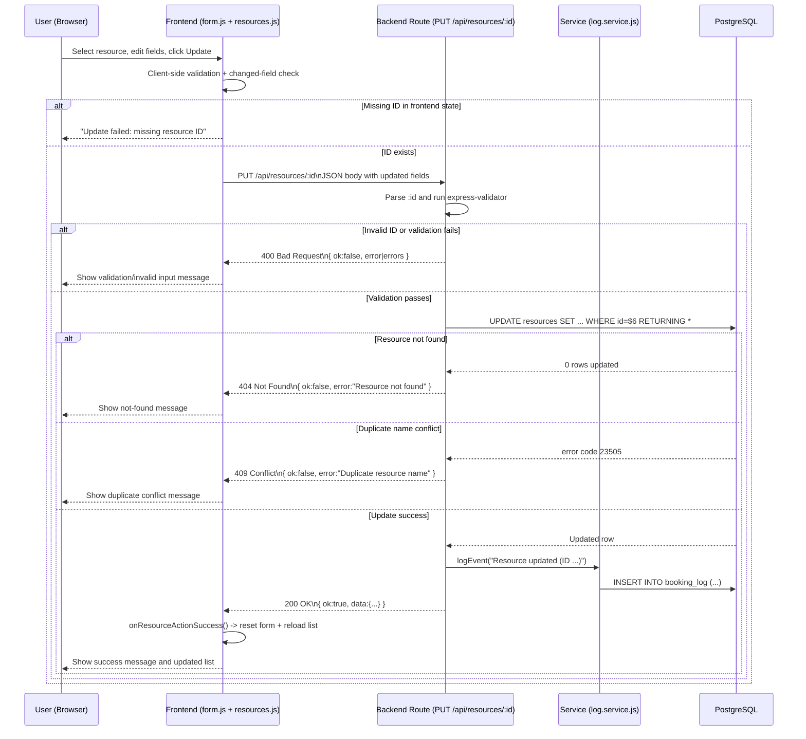
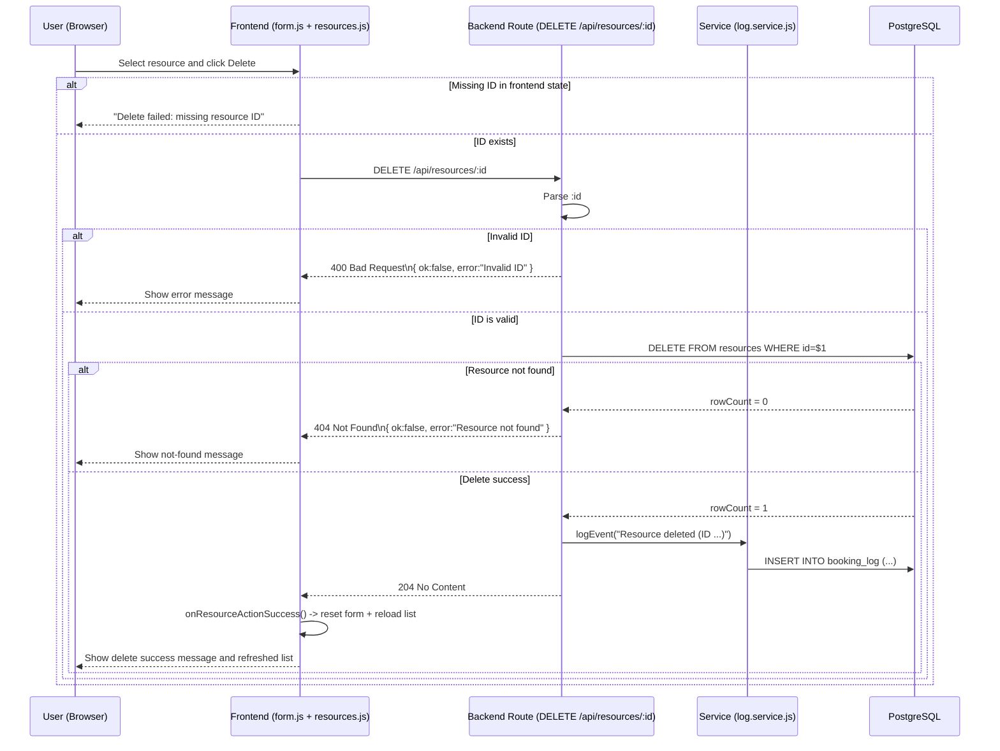

# G1 - CRUD Data Flow (Phase6 Booking System)

This document models the actual CRUD request/response flow implemented in Phase6.

Observed implementation sources:
- Frontend: public/resources.js, public/form.js
- Backend API: src/routes/resources.routes.js
- Validation: src/validators/resource.validators.js
- Service layer: src/services/log.service.js
- Database schema: db/init/001_create_resources.sql, db/init/002_create_logs.sql

## CREATE (C) - POST /api/resources



## READ (R) - GET /api/resources

```mermaid
sequenceDiagram
    participant U as User (Browser)
    participant F as Frontend (resources.js)
    participant B as Backend Route (GET /api/resources)
    participant S as Service (log.service.js)
    participant DB as PostgreSQL

    U->>F: Open resources page / trigger refresh
    F->>B: GET /api/resources
    B->>DB: SELECT * FROM resources ORDER BY created_at DESC

    alt Query success
        DB-->>B: Rows
        B-->>F: 200 OK\n{ ok:true, data:[...] }
        F->>F: resourcesCache = data; renderResourceList(data)
        F-->>U: Resource list displayed/updated
    else Database error
        DB-->>B: SQL error
        B-->>F: 500 Internal Server Error\n{ ok:false, error:"Database error" }
        F->>F: console.error("Failed to load resources", ...)
        F-->>U: Empty list/fallback state
    end

    Note over S: No service-layer logging call is used in current READ ALL route.
```

## UPDATE (U) - PUT /api/resources/:id



## DELETE (D) - DELETE /api/resources/:id



## Endpoint Summary (Phase6)

| CRUD | Method | Endpoint | Success status | Example failure statuses seen in code |
|---|---|---|---|---|
| Create | POST | /api/resources | 201 | 400, 409, 500 |
| Read all | GET | /api/resources | 200 | 500 |
| Read one | GET | /api/resources/:id | 200 | 400, 404, 500 |
| Update | PUT | /api/resources/:id | 200 | 400, 404, 409, 500 |
| Delete | DELETE | /api/resources/:id | 204 | 400, 404, 500 |

## Runtime Verification Notes (2026-03-22)

Deployment status:
- Docker stack started successfully with `docker compose up -d --build`
- Web container: `booking-system-phase6-web` (port 5000)
- DB container: `booking-system-phase6-db` (port 5432)

Observed API calls and responses:

| Operation | Request | Observed status | Observed response (short) |
|---|---|---|---|
| Read all (success) | GET /api/resources | 200 | `{ "ok": true, "data": [...] }` |
| Create (validation fail) | POST /api/resources (invalid body) | 400 | `{ "ok": false, "errors": [...] }` |
| Create (success) | POST /api/resources | 201 | `{ "ok": true, "data": { "id": 3, ... } }` |
| Create (duplicate fail) | POST /api/resources (same name) | 409 | `{ "ok": false, "error": "Duplicate resource name" }` |
| Update (success) | PUT /api/resources/3 | 200 | `{ "ok": true, "data": {...} }` |
| Update (not found fail) | PUT /api/resources/999999 | 404 | `{ "ok": false, "error": "Resource not found" }` |
| Delete (success) | DELETE /api/resources/3 | 204 | no content |
| Delete (not found fail) | DELETE /api/resources/3 (again) | 404 | `{ "ok": false, "error": "Resource not found" }` |

Note:
- The same endpoints/status patterns are what should appear in Browser DevTools Network tab during UI actions.
